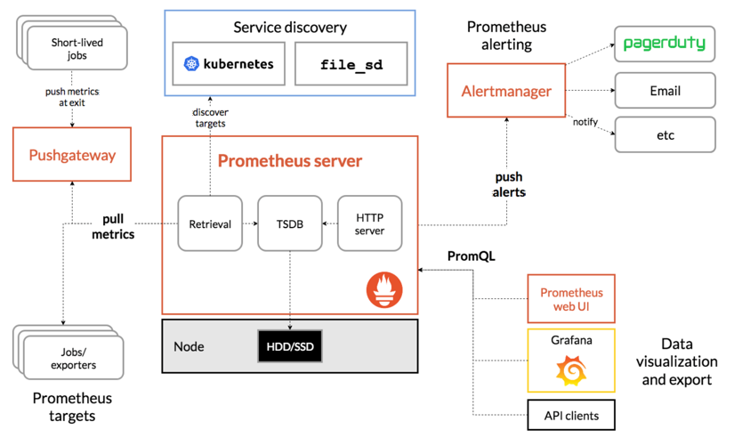

[toc]

## 基本原理

### 时序数据库(TSDB)

- Time Serier DataBase
- 用于保存时间序列(按时间顺序变化)的数据
- 每条记录都有完整的时间戳, 基于时间的操作都比较方便

**优点**

- 时间作为主轴, 数据按顺序到达
- 大多数操作是插入新数据, 偶尔查询, 更新数据比较少
- 时间序列数据累计速度非常快, 更高的容乃率, 更快的大规模查询以及更好的数据压缩
- TSDB通常还包括一些共同的对时间序列数据分析的功能和操作: 数据保留策略, 灵活的时间聚合等

**工作过程**

- 数据来源是一些官方的exporter, 自定义sdk或接口
- Service通过http的pull方式采集监控数据, 并在本地存储到tsdb中
- 不能直接网络胡同的原数据可以通过push gateway组件代理, 以实现数据收集
- Tsdb有自带的查询语言promql, 可以查询监控数据
- 报警方式是通过promql写规则, 与设置的阈值进行匹配, 超过阈值报警, 这个组件也是独立的 alertmanager
- Server 同时提供了简单的 ui , 可以查看配置拆线呢数据, 当然通常的展示借助第三方插件比如 grafana

## 组件介绍

### 工作原理



### 安装部署

#### Prometheus

下载地址: https://prometheus.io/download/


**安装**

```shell
wget https://github.com/prometheus/prometheus/releases/download/v2.28.1/prometheus-2.28.1.linux-amd64.tar.gz
tar -xf prometheus-2.28.1.linux-amd64.tar.gz -C /usr/local/
cd /usr/local/prometheus-2.28.1.linux-amd64/
```

**配置文件** prometheus.yml

```yaml
# my global config
global:
  # 收集数据时间间隔, 规则发现时间间隔, 收集数据超时时间 默认分别为1m 1m 10s
  scrape_interval:     15s # Set the scrape interval to every 15 seconds. Default is every 1 minute.
  evaluation_interval: 15s # Evaluate rules every 15 seconds. The default is every 1 minute.
  scrape_timeout: 10s      # scrape_timeout is set to the global default (10s).

# Alertmanager configuration
# 关联报警配置, 定制alertmanager组件的ip和端口
alerting:
  alertmanagers:
  - static_configs:
    - targets:
      - 127.0.0.1:9093

# Load rules once and periodically evaluate them according to the global 'evaluation_interval'.
# 规则配置文件的地址, 支持正则匹配
rule_files:
  - "./rules/rule_*.yml"
  # - "first_rules.yml"
  # - "second_rules.yml"

# prometheus支持将数据远程写入到其他的时序数据库中, 比如influxdb, 远程写入相关配置如下:
# remote_write:
# - url: http://remote1/push
#   write_relabel_configs:
#   - source_labels: [_name__]
#     regex: expensive.*
#     action: drop
# - url: http://remote2/push
# 同时还支持远程读取, 可以从其他的时序数据库中读取数据, 配置如下:
# - url: http://remote1/read
#   read_recent: true
# - url: http://remote2/read
#   read_recent: false
#   required_matchers:
#     job: special

# 收集数据配置列表, 通过job_name进行分类, 每个job_name收集不同的类型
# A scrape configuration containing exactly one endpoint to scrape:
# Here it's Prometheus itself.
# 这个是prometheus自己的例子
scrape_configs:
  # The job name is added as a label `job=<job_name>` to any timeseries scraped from this config.
  - job_name: 'prometheus'  # 必须参数, 这个地址专区的所有数据会自动加上`job=prometheus`的标签

    # metrics_path defaults to '/metrics' # 抓取监控目标的路径, 默认是 /metrics 可以根据自己业务的需要进行修改
    # scheme defaults to 'http'.

    static_configs: # 这个是通过静态文件的配置方法: 这种方法直接指定要抓取目标的ip和端口
    - targets: ['localhost:9090']
  # 这个job是指定prometheus的gateway地址, 指定之后prometheus会定期从gateway抓取数据
  - job_name: gate_way
    static_configs:
    - targets: ['127.0.0.1:9001']
      labels: # 打上标签, instance会呗指定为 'gateway'
        instance: gateway
  # 这个job是监控主机的, 这个例子中用到了file_sd_configs的功能, 就是通过配置文件的方法自动发现配置, 
  # 之后有新添加的主机, 直接维护下面files指定的文件就可以了, 在files里新增主机配置, prometheus会自动的发现并应用,
  # 这样的好处是防止配置文件冗长, files里文件格式为:
  # [
  #     {
  #         "targets": ["127.0.0.1:9100"],
  #         "labels": {
  #             "instance": "test"
  #         }
  #     },
  #     {
  #         "targets":["xxx.xxx.xxx.xxx:9100"],
  #         "labels": {
  #             "instance": "test1"
  #         }
  #     }
  # ]
  # 推荐这样的方法, 我们在instance里面可以加上主机的属性来区分不同的主机
  - job_name: node_export
    file_sd_configs:
    # refresh_interval: 1m  # 刷新发现新文件的时间间隔
    - files:
      - /data/prometheus-2.12.0.linux-amd64/nodediscovery.json
  # # 通过配置中心监控
  # - job_name: service-y
  #   consul_sd_configs:  # consul 服务发现 配置列表
  #   - server: 'localhost:1234' # consul API 地址
  #     token: mysecret
  #     services: ["nginx", "cache", "mysql"] # 被检索目标的服务列表, 如果不定义, 那么所有服务都会被收集
  #     tls_config:
  #       ca_file: valid_ca_file
  #       cert_file: valid_cert_file
  #       key_file: valid_key_file
  #       insecure_skip_verify: false
  # # 黑盒监控
  # - job_name: "black_box"
  #   metrics_path: /probe
  #   params:
  #     module: [http_2xx]
  #     static_configs:
  #       - targets:
  #         - https://shimo.im
  #         - https://shimodev.com
  #     relabel_configs:
  #       - source_labels: [__address__]
  #         target_label: __param_target
  #       - source_labels: [__param_target]
  #         target_label: instance
  #       - target_label: __address__
  #         replacement: 127.0.0.1:9115
```

**启动**

```shell
nohup ./prometheus --storage.tsdb.path=./data --storage.tsdb.retention.time=168h --web.enable-lifecycle --storage.tsdb.no-lockfile &
```
**启动参数**

| --config.file=                    | 指定配置文件                    |
| --------------------------------- | ------------------------------- |
| --storage.tsdb.path=/prometheus   | 指定tsdb路径 /ssd               |
| --storage.tsdb.retention.time=24h | 指定数据存储时间                |
| --web.enable-lifecycle            | 提供类似nginx的reload功能       |
| --storage.tsdb.no-lockfile        | 如果用k8s的deployment管理要开启 |

#### pushgateway

下载地址: https://prometheus.io/download/

当需要组件主动把数据推送到gateway时, 需要使用pushgateway

- 因为Prometheus在配置pushgateway的时候, 也会指定job和instance, 但是它不能真正表达收集数据的含义;

  所以在Prometheus中配置pushgateway的时候, 需要加**honor_labels: true**, 从而避免收集数据本身的job和instance被覆盖

- 可以通过 -persistence.file 和 -persistence.interval 参数将数据持久化下来
- 万一gateway挂了, 那么后端所有的资源都无法采集, 可以用lvs给gateway做双活, 避免单节点故障
- 拉取状态up只针对gateway有效, 无法精确到后端节点

**安装**

```shell
wget https://github.com/prometheus/pushgateway/releases/download/v1.4.1/pushgateway-1.4.1.linux-amd64.tar.gz
```


#### alertmanager

下载地址: https://prometheus.io/download/

- 分组, 太多的报警信息来到时, 可以分组发送
- 抑制, 如果一个报警规则触发后, 后面相同的出发就会被抑制
- 静音, 直接将个别报警进行屏蔽
- 高可用, 可以组成alertmanager集群

**安装**

```shell
wget https://github.com/prometheus/alertmanager/releases/download/v0.22.2/alertmanager-0.22.2.linux-amd64.tar.gz
tar -xf alertmanager-0.22.2.linux-amd64.tar.gz -C /usr/local/
cd /usr/local/alertmanager-0.22.2.linux-amd64/
```

**启动**

```shell
no./alertmanager --config.file="alertmanager.yml &
```


##### 报警规则

##### 接收

##### 抑制

##### 报警分组


